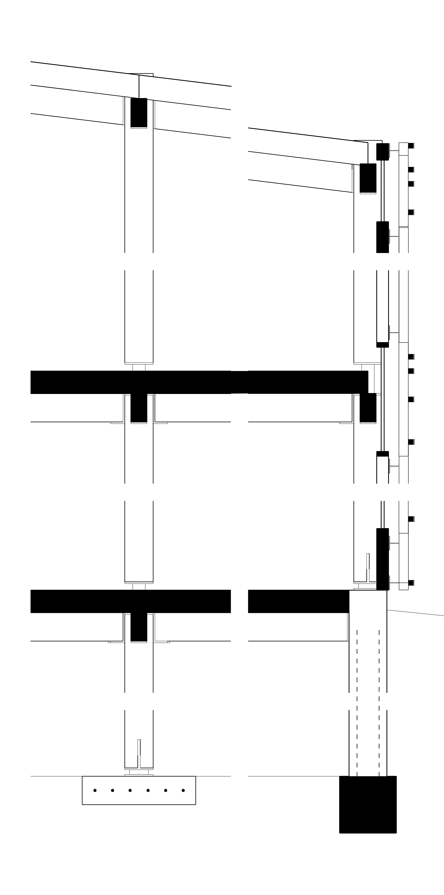

# Day-1 Blog / Listing Outline

Current source of truth: [`LAUNCH_KIT.md`](LAUNCH_KIT.md). This is Day-1 copy,
not a hosted-product launch post.

## Working Title

**I built a source-install CLI for Rhino-to-Illustrator line weights**

## Core Claim

`arch-line-weights` is a Python CLI that applies architectural line-weight
hierarchy to Rhino/Make2D `.ai` and `.pdf` exports. At Day 1 it is a
source/GitHub install, with `usc` preset support landed and section proof
passed via the Illustrator bridge path.

## Required Facts

- `usc` preset landed.
- Release-gate checks were green for the source/GitHub handoff.
- Source/GitHub install only.
- Local webapp is experimental only.
- Axon stress-test passed on `macro_for_archlw.ai`: 98 MB, 1.28M strokes,
  `apply-saas` exit 0, about 1:53 runtime.
- That is large-file/performance evidence, not section/poché proof, because
  the axon file has no `ClippingPlaneIntersections`.
- `wall section iso cut .ai` is legacy Rhino PostScript `.ai`, not
  PDF-compatible Illustrator `.ai`; it needs Illustrator Save As.
- Section proof passed via Illustrator bridge on `WALL SECTION [Converted].ai`:
  `apply-jsx --preset usc --source rhino --for-print`, then
  `arch-lw poche --source rhino --style solid --bridge-strategy best`.
- `apply-jsx` hierarchy: 25 leaf layers, 512 paths modified, 0 errors,
  Illustrator opens the output.
- Poché (`arch-lw poche`): 30 poché polygons, 8 cut layers, 0 failed layers,
  Illustrator opens the final output.
- `apply-saas --poche` is not usable on this PDF-only/converted lineage because
  there is no `/NumBlock`; use the Illustrator bridge path for those files.
- v1 input-format note: if Rhino legacy `.ai` fails, open it in Illustrator,
  Save As modern/PDF-compatible `.ai`, then rerun.
- Proof screenshots are captured in `docs/img/day1-proof/`.
- Do not claim PyPI, hosted-cloud, or Bluebeam support.
- Do not claim universal Rhino export support.

## Outline

### 1. The Workflow Problem

Open with the Rhino/Make2D to Illustrator workflow: exported vector drawings
need architectural hierarchy, but students often spend deadline time assigning
weights by hand.


### 2. What the Tool Does

Explain the hierarchy in plain architectural terms: cut/profile/visible/hidden/
surface, optional conservative poché, and presets for common drawing types.
Mention that `usc` is now the studio-board preset.


### 3. Latest Dogfood Facts

Say that the latest axon stress-test succeeded on `macro_for_archlw.ai`: 98 MB,
1.28M strokes, `apply-saas` exit 0, about 1:53 runtime. Immediately qualify it:
this is not section/poché proof because the file has no
`ClippingPlaneIntersections`.

Also note the input-format lesson: `wall section iso cut .ai` is legacy Rhino
PostScript `.ai`, not PDF-compatible Illustrator `.ai`, and needs Illustrator
Save As. Section proof passed via Illustrator bridge on `WALL SECTION [Converted].ai`:
`apply-jsx` hierarchy modified 512 paths across 25 leaf layers with 0 errors,
then `arch-lw poche` produced 30 poché polygons across 8 cut layers with
0 failed layers. Illustrator opens the final output.
`apply-saas --poche` is not usable on this PDF-only/converted lineage because
there is no `/NumBlock`. For v1, if Rhino legacy `.ai` fails, open it in
Illustrator, Save As modern/PDF-compatible `.ai`, then rerun.

### 4. The Day-1 Install Story

Show source install only:

```bash
git clone https://github.com/zohartito/arch-line-weights
cd arch-line-weights
python -m venv .venv
.venv/bin/python -m pip install -e .
.venv/bin/arch-lw --help
```

Optional GitHub/pipx:

```bash
pipx install git+https://github.com/zohartito/arch-line-weights
```

### 5. The Current Section Proof Command

```bash
.venv/bin/arch-lw apply-jsx "WALL SECTION [Converted].ai" \
  --preset usc --source rhino --for-print
.venv/bin/arch-lw poche "WALL SECTION [Converted] HIERARCHY-jsx.ai" \
  --source rhino --style solid --bridge-strategy best
```

Note: `apply-saas` is the local CLI command name, not a hosted cloud product.
`apply-saas --poche` is not usable on PDF-only/converted lineages without
`/NumBlock`; use the Illustrator bridge path for those files.


### 6. What Is Not Done Yet

Be explicit:

- PyPI is not live.
- The webapp is a local experimental scaffold, not a hosted cloud product.
- Bluebeam is not verified.
- Proof screenshots captured in `docs/img/day1-proof/`.
- `apply-saas --poche` is not usable on PDF-only/converted files without
  `/NumBlock`; use the Illustrator bridge path for those files.

### 7. Ask

Ask for real Rhino/Illustrator edge cases, layer naming examples, and feedback
on the `usc` preset after users test on copies of their drawings.



## Listing Copy

- **Name:** arch-line-weights
- **Tagline:** Apply architectural line-weight hierarchy to Rhino-exported drawings.
- **Install:** Source checkout or GitHub/pipx install only.
- **Status:** Day-1 source/GitHub release; release-gate checks green; 98 MB /
  1.28M-stroke axon stress-test passed in about 1:53; section hierarchy +
  Illustrator-bridge poché proof passed on `WALL SECTION [Converted].ai`;
  proof screenshots captured.
- **Not yet:** PyPI, hosted cloud product, Bluebeam verification, universal Rhino export support.
