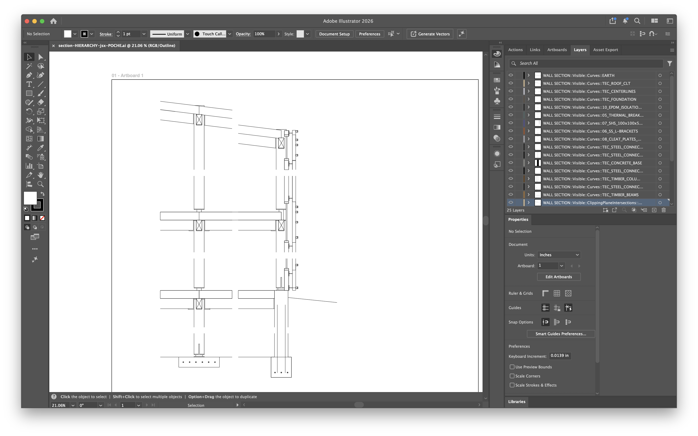

# Day-1 Launch Kit

Status source: Day-1 source/GitHub release gate, 2026-05-30.

## Current Facts

- `usc` preset landed and is documented.
- Release-gate checks were green for the source/GitHub handoff.
- Public install path is source checkout or GitHub/pipx install only.
- Webapp is local experimental scaffold only, not a hosted product.
- Section proof passed via Illustrator bridge; proof screenshots are captured
  and embedded below.
- Do not claim PyPI availability, a hosted cloud product, Bluebeam support, or paid product readiness.
- Do not claim universal Rhino export support.

## Latest Dogfood Facts

- Axon stress-test succeeded on `macro_for_archlw.ai`: 98 MB, 1.28M strokes,
  `apply-saas` exit 0, about 1:53 runtime.
- That axon file is large-file/performance evidence, not section/poché proof:
  it has no `ClippingPlaneIntersections`.
- `wall section iso cut .ai` is legacy Rhino PostScript `.ai`, not
  PDF-compatible Illustrator `.ai`; it needs Illustrator Save As before rerun.
- Section proof passed via Illustrator bridge on `WALL SECTION [Converted].ai`:
  `arch-lw apply-jsx --preset usc --source rhino --for-print`, then
  `arch-lw poche --source rhino --style solid --bridge-strategy best`.
- `apply-jsx` hierarchy pass: 25 leaf layers, 512 paths modified, 0 errors,
  Illustrator opens the output.
- Illustrator-bridge poché pass: 30 poché polygons, 8 cut layers,
  0 failed layers, Illustrator opens the final output.
- `apply-saas --poche` is not usable on this PDF-only/converted lineage because
  there is no `/NumBlock`; use the Illustrator bridge path for those files.
- v1 input-format note: if Rhino legacy `.ai` fails, open it in Illustrator,
  Save As modern/PDF-compatible `.ai`, then rerun.
- Proof screenshots captured (see the Proof Screenshots section).

## Proof Screenshots

Captured from the section proof on `WALL SECTION [Converted].ai` (Illustrator
bridge: `apply-jsx` → `arch-lw poche`). Files live in `docs/img/day1-proof/`.


*Before: raw Rhino/Make2D export — uniform line weights.*


*After `apply-jsx`: cut/profile/visible/hidden/surface hierarchy applied, layers preserved.*


*After `arch-lw poche`: solid-black poché on the section-cut mass.*


*Layers panel: original `ClippingPlaneIntersections::*` layers preserved, with black poché fills.*


*Close-up: solid cut mass; window openings correctly left white.*

Full poché output as PDF: [`section-HIERARCHY-jsx-POCHE.pdf`](../img/day1-proof/section-HIERARCHY-jsx-POCHE.pdf).

Do not use webapp screenshots in Day-1 copy unless explicitly labeled "local experimental scaffold."

## Canonical Install Block

```bash
git clone https://github.com/zohartito/arch-line-weights
cd arch-line-weights
python -m venv .venv
.venv/bin/python -m pip install -e .
.venv/bin/arch-lw --help
```

Optional global install if `pipx` is already available:

```bash
pipx install git+https://github.com/zohartito/arch-line-weights
```

## Canonical Dogfood Command

For PDF-only/converted section files, use the Illustrator bridge path:

```bash
.venv/bin/arch-lw apply-jsx "WALL SECTION [Converted].ai" \
  --preset usc --source rhino --for-print
.venv/bin/arch-lw poche "WALL SECTION [Converted] HIERARCHY-jsx.ai" \
  --source rhino --style solid --bridge-strategy best
```

For PDF-compatible Illustrator `.ai` files with AI private data, the local
`apply-saas` path remains available:

```bash
.venv/bin/arch-lw inspect path/to/rhino-export.ai
.venv/bin/arch-lw apply-saas path/to/rhino-export.ai \
  --architectural --poche --preset usc --source rhino
```

`apply-saas` is the local CLI command name for the AI-private rewrite path; it
does not mean a hosted cloud product is available. `apply-saas --poche` is not
usable on PDF-only/converted lineages without `/NumBlock`; use the Illustrator
bridge path for those files.

For fast stroke-weight-only output:

```bash
.venv/bin/arch-lw apply path/to/rhino-export.ai --auto --preset usc
```

## Day-1 Post

### Title Options

- I built a CLI that applies architectural line weights to Rhino exports
- arch-line-weights: Rhino-to-Illustrator line hierarchy from a source checkout
- Turning Rhino Make2D output into cleaner studio linework with one command

### Body

I built `arch-line-weights`, a small Python CLI for a very specific architecture-school pain: Rhino/Make2D exports that arrive in Illustrator with hundreds of thousands of strokes but no useful line-weight hierarchy.

It inspects `.ai`/`.pdf` exports, maps strokes into architectural tiers, and applies a practical hierarchy: cut, profile, visible, hidden, surface/texture, plus optional conservative poché. The new `usc` preset is tuned for studio-board linework, with the print convention documented in `CONVENTIONS.md`.

Current Day-1 status:

- `usc` preset is in the CLI and docs.
- Release-gate checks were green for the source/GitHub handoff.
- Install is source/GitHub only right now; PyPI is not live.
- Webapp exists only as a local experimental scaffold.
- Latest dogfood: `macro_for_archlw.ai` axon stress-test succeeded at 98 MB /
  1.28M strokes with `apply-saas` exit 0 in about 1:53.
- That axon run is not section/poché proof because the file has no
  `ClippingPlaneIntersections`.
- A `wall section iso cut .ai` attempt exposed an input-format caveat: legacy
  Rhino PostScript `.ai` needs Illustrator Save As before rerun.
- Section proof passed via Illustrator bridge on `WALL SECTION [Converted].ai`.
- `apply-jsx` hierarchy: 25 leaf layers, 512 paths modified, 0 errors,
  Illustrator opens the output.
- Poché via `arch-lw poche`: 30 poché polygons, 8 cut layers,
  0 failed layers, Illustrator opens the final output.
- `apply-saas --poche` is not usable on this PDF-only/converted lineage because
  there is no `/NumBlock`; use the Illustrator bridge path for those files.
- Proof screenshots captured (see the Proof Screenshots section).

Install from source:

```bash
git clone https://github.com/zohartito/arch-line-weights
cd arch-line-weights
python -m venv .venv
.venv/bin/python -m pip install -e .
.venv/bin/arch-lw --help
```

The current section proof path:

```bash
.venv/bin/arch-lw apply-jsx "WALL SECTION [Converted].ai" \
  --preset usc --source rhino --for-print
.venv/bin/arch-lw poche "WALL SECTION [Converted] HIERARCHY-jsx.ai" \
  --source rhino --style solid --bridge-strategy best
```

This proves the section hierarchy + Illustrator-bridge poché path on this file.
It does not make `apply-saas --poche` usable on this PDF-only/converted lineage.

v1 input-format note: if Rhino legacy `.ai` fails, open it in Illustrator,
Save As modern/PDF-compatible `.ai`, then rerun. `WALL SECTION [Converted].ai`
passed via the Illustrator bridge path. `apply-saas --poche` is not usable on
this PDF-only/converted lineage because there is no `/NumBlock`.

Screenshots (full set in `docs/img/day1-proof/`):


What I am looking for now: real Rhino/Illustrator edge cases, layer naming conventions that break the classifier, and feedback from anyone who has had to clean up Make2D output under deadline.

Repo: https://github.com/zohartito/arch-line-weights

## Short Listing Copy

**Name:** arch-line-weights

**Tagline:** Apply architectural line-weight hierarchy to Rhino-exported drawings.

**Short description:**
Python CLI for post-processing Rhino/Make2D `.ai` and `.pdf` exports. It classifies linework into cut, profile, visible, hidden, and surface tiers, applies source-controlled presets including a USC studio-board preset, and can add conservative poché for high-confidence section cuts.

**Install:** Source checkout or GitHub/pipx install only. PyPI is not live yet.

**Status:** Day-1 source/GitHub release; release-gate checks green; 98 MB /
1.28M-stroke axon stress-test passed in about 1:53; section hierarchy +
Illustrator-bridge poché proof passed on `WALL SECTION [Converted].ai`;
proof screenshots captured.

**Not yet:** Hosted cloud product, PyPI package install, Bluebeam-tested workflow, or
universal Rhino export support.

## Longer Listing Copy

`arch-line-weights` is a source-install Python CLI for cleaning up architectural vector exports, especially Rhino/Make2D files opened in Illustrator. It gives exported drawings a readable architectural hierarchy without manually selecting every layer and stroke color.

Use it to inspect stroke colors and layer-derived categories, then apply presets for section, plan, elevation, detail, or USC studio-board output. The `usc` preset follows the project convention file for cut/profile/visible/hidden/surface hierarchy and uses a practical print-weight ladder.

The project is currently a Day-1 source/GitHub release, and the latest axon stress-test passed on a 98 MB / 1.28M-stroke file in about 1:53. That axon run is large-file evidence, not section evidence, because the stress file had no `ClippingPlaneIntersections`. Section proof passed separately via the Illustrator bridge path on `WALL SECTION [Converted].ai`: hierarchy modified 512 paths across 25 leaf layers with 0 errors, then poché produced 30 poché polygons across 8 cut layers with 0 failed layers. This is not yet a PyPI package, not a hosted cloud product, and not tested in Bluebeam. The local webapp scaffold is experimental and is not the public install path.

Input-format caveat for v1: legacy Rhino PostScript `.ai` exports may fail. If
that happens, open the file in Illustrator, Save As modern/PDF-compatible `.ai`,
then rerun the CLI. For PDF-only/converted lineages without `/NumBlock`,
`apply-saas --poche` is not usable; use `apply-jsx` followed by `arch-lw poche`.

## Channel Variants

### Hacker News / Dev Audience

`arch-line-weights` is a Python CLI that rewrites architectural vector linework after Rhino export. The technical bit is mapping PDF/AI stroke operators and Rhino/Make2D layer semantics into a small architectural hierarchy, then optionally generating conservative poché from high-confidence cut regions.

It is source/GitHub install only for now:

```bash
pipx install git+https://github.com/zohartito/arch-line-weights
```

No PyPI release yet, no hosted cloud product. The local webapp scaffold is experimental. I am looking for feedback on PDF/AI edge cases, Make2D layer naming, and better real-world fixtures.

Latest dogfood: `macro_for_archlw.ai` passed as a 98 MB / 1.28M-stroke axon
stress-test in about 1:53. It does not prove section poché because it has no
`ClippingPlaneIntersections`.

Section proof passed separately via the Illustrator bridge path on
`WALL SECTION [Converted].ai`: hierarchy modified 512 paths across 25 leaf
layers with 0 errors, then poché produced 30 poché polygons across 8 cut layers
with 0 failed layers. Illustrator opens the final output.

### Architecture / Studio Audience

This is for the boring but painful part after Rhino export: turning uniform Make2D linework into a drawing that reads like a section, plan, or elevation.

`arch-line-weights` applies an architectural hierarchy automatically: cut and poché get the strongest treatment, profiles sit below that, visible edges are lighter, hidden/overhead lines are dashed/light, and surface texture stays quiet. The `usc` preset is aimed at studio-board output.

It is still Day-1 source-install software. Real-board dogfood is next, so treat it as a tool to test on copies of your drawings, not as a guaranteed deadline workflow yet.

Known v1 input caveat: legacy Rhino PostScript `.ai` may need to be opened in
Illustrator and re-saved as modern/PDF-compatible `.ai` before rerunning.
`WALL SECTION [Converted].ai` proved the Illustrator bridge path: `apply-jsx`
for hierarchy, then `arch-lw poche --style solid --bridge-strategy best`.
`apply-saas --poche` is not usable on this PDF-only/converted lineage because
there is no `/NumBlock`; use the bridge path for those files.

## Do-Not-Say List

- Do not present plain PyPI install as the primary install path.
- Do not say "hosted app," "cloud upload," or "browser product" without "experimental local scaffold."
- Do not say "Bluebeam supported" or "Bluebeam verified."
- Do not say "ready for production use" or "board-proven" before the real-board dogfood pass.
- Do not imply the CLI has been validated on every Rhino/Illustrator export shape.
- Do not use the axon stress-test as section/poché proof.
- Do not imply `apply-saas --poche` works on PDF-only/converted files without
  `/NumBlock`; point those files to the Illustrator bridge path.
